# LC3 VSCode Integration
## Syntax Highlighting/Coloring
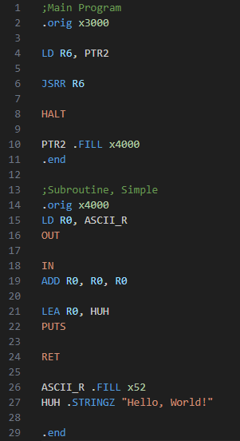

## Code Diagnostics
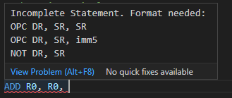 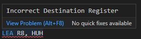

## Integrated Simulated "Debugger"
### Use VSCode's Debugger to Simulate LC-3 Programs

### Simple Register and Memory View
 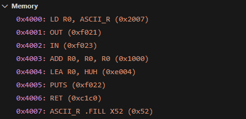

### Memory Table/Search
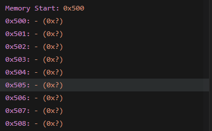  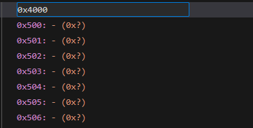  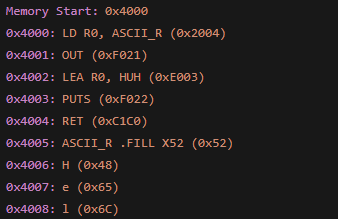
### Easy to access stack
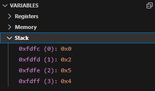

### Editable memory
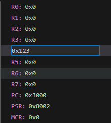

### Breakpoints
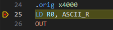 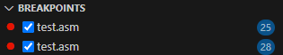

## Notes on use:
1. Press F5 on the File or open Debug panel and click "Launch and Debug"
2. Select "Simulator" or "Grader"
	1. Simulator provides deeper info and interaction with code
	2. Grader uses [LC3-Tools](https://github.com/chiragsakhuja/lc3tools) CLI to match UCR's Auto-Grader as close as possible
3. Input relative path from workspace folder to .asm or .lc3 file (``./test.asm`` or ``Folder/OtherFolder/LabNumber400_and_6.lc3``)
	1. Please avoid spaces (``./test file.asm``), this will result in an error, use ``_`` instead
4. If you'd like to avoid this input, you can create a launch.json (it's an option in the Debug Panel when not debugging) and it will infer the active text editor as the file to debug
5. Debug your program