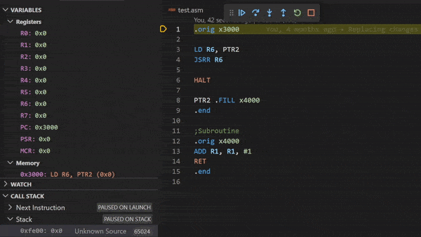

[Insert UCR Logo Here]

# UCR's Vscode LC3-Extension
## Code Highlighting
* Registers
	* PIC TODO 
* Opcodes
	* PIC TODO
* Numbers
	* PIC TODO
* Macros
	* PIC TODO
* Pseudo-ops
	* PIC TODO

## Integrated Simulated "Debugger"
* Use VSCode's Debugger to Simulate LC-3 Programs
	* 
* Clear Register and Memory View
	* 
* Memory Table/Search
	* TODO
* Easy to access stack
	* TODO
* Editable memory
	* TODO
* Breakpoints
	* TODO

[Insert images ofc]